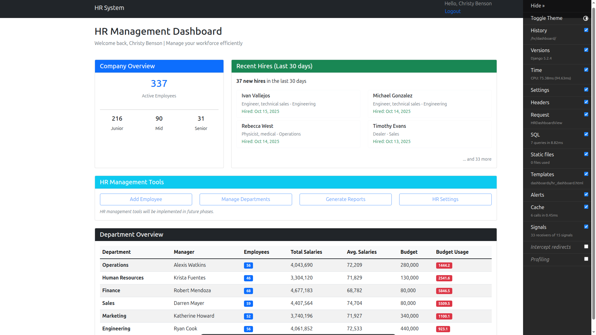
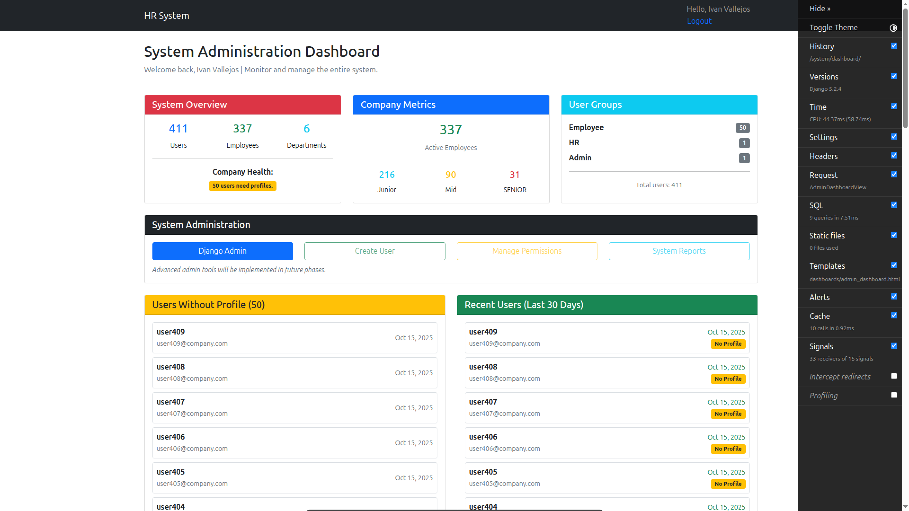
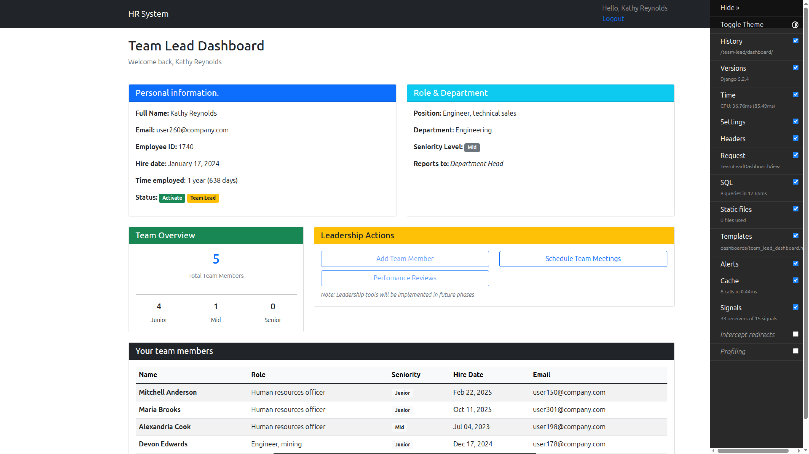

<!-- SECCION 1: HEADER + DESCRIPCION -->
# HR Management System.
> Sistema integral de gestión de recursos humanos con arquitectura multi-role y sistema jerárquico de permisos.
Diseñado para gestionar empleados, departamentos, roles y jerarquías organizacionales. Implementa dashboards diferenciados según el rol del usuario (Admin, HR, Team Lead, Employee) con métricas en tiempo real y herramientas de gestión específicas para cada nivel.


<!-- SECCION 2: BADGES (analizar su iplementacion) -->


<!-- SECCION 3: SCREENSHOTS + GIFS -->

## Vista Previa
> Estos screenshots fueron tomadas luego de sembrar el sistema con un preset de 300 empleados para simular estadísticas realistas.
<div align="center">
    
    <p><em>Dashboard principal con metricas en tiempo real</em></p>
</div>

### Dashboards por Rol

<table>
    <tr>
        <td width="33%">
            
            <p align="center"><strong>Admin Dashboard</strong></p>
        </td>
        <td width="33%">
            
            <p align="center"><strong>HR Dashboard</strong></p>
        </td>
        <td width="33%">
            
            <p align="center"><strong>Team Lead Dashboard</strong></p>
        </td>
    </tr>
</table>

<!-- SECCION 4: FEATURES (analizar el contenido) -->
## Features principales
### Sistema de Roles y permisos.
- *Admin*: Gestion total del sistema, control de usuarios y configuración.
- *HR*: Gestion de empleados, departamentos y reportes estadísticos.
- *Team Lead*: Supervisión de equipo, métricas de rendimiento.
- *Employee*: Dashboard personal con información y acciones básicas.

### Performance y Optimización.
- *Sistema de cache*: con django Cache Framework (TTL: 5-15 min).
- *Query Optimization* usando 'select_related()' y 'prefetch_related()'.
- Reduccion de carga de dashboard de ~800ms a ~150ms.

### Seguridad.
- *Middleware* custom con verificación de perfiles de empleado.
- *Headers* de seguridad (X-Frame-Options, X-Content-Type-Options, etc.).
- Sistema de permisos basado en grupos de Django.
- Proteccion CSRF activada.

### Testing.
- Tests unitarios y de integración.
- Cobertura con pytest y factory-boy.
- Fixtures reutilizables para datos de prueba.
- Tests parametrizados para casos edge.

### Developer Experience.
- Management commands('seed_data', 'clear_data') con progress bar.
- Logging configurado por app.
- Debug toolbar integrado (en modo desarrollo).
- Presets de datos (small/medium/large).

### Analytics.
- Custom managers para analytics queries.
- Todos los metodos son chainables y siguen los patrones Django estandar.

<!-- SECCION 5: TECH STACK. -->
## Stack Tecnologico.
### Backend.
- **Framework** Django 5.2.4
- **Database** PostgreSQL 15
- **ORM** Django con optimizacion de queries.
- **Cache** Django Cache Framework.

### Testing & Quality.
- **Testing** pytest, pytest-django.
- **Fixtures** Faker, Factory boy. 
<!-- Preguntar sobre estilo de codigo: Flake8 -->

### DevTools.
 <!-- Pregunntar sobre environment y si no va mejor venv  -->
- **Environment** django-environ.
- **Debug** django-debug-toolbar.
- **Version Contro** Git

<!-- SECCION 6: INSTALACION Y CONFIGURACION. -->
## Instalacion y Configuracion.
### 0- Prerrequisitos.
- Python 3.11 o superior.
- PostgreSQL 15 o superior.
- Git

### 1- Clonar el repositorio.
```bash
git clone https://github.com/ivanvallejoss/hr_system.git
cd hr_system
```

### 2- Crear y activar el entorno virtual.
- Linux/macOS
python -m venv venv
. venv/bin/activate

- Windows
python -m venv venv
venv\Scripts\activate

### 3- Instalar Dependencias.
```pip install -r requirements.txt```

### 4- Configurar base de datos o variables de entorno.
**OPCION A - Crear Base de datos Manualmente**

-- Conectar a PostgreSQL.
```bash
psql -U postgres
```

-- Crear base de datos.
``` sql
CREATE DATABASE hr_system;
CREATE USER hr_admin WITH PASSWORD 'tu_password_segura';
GRANT ALL PRIVILEGES ON DATABASE hr_system to hr_admin;
```

**OPCION B - Usar variables de entorno**
Crear archivo `.env` en la raiz del proyecto:
``` env 
DEBUG=True
SECRET_KEY=your-secret-key
ALLOWED_HOSTS=localhost,127.0.0.1

DB_NAME=hr_system
DB_USER=hr_admin
DB_PASSWORD=your_password
DB_HOST=localhost
DB_PORT=5432
```

You can generate a secure SECRET_KEY with the following script:
``` python
python -c 'from django.core.management.utils import get_random_secret_key; print(get_random_secret_key())'
```

### 5- Ejecutar Migraciones.
``` bash
python manage.py makemigrations

python manage.py migrate
```

### 6- Crear superusuario.
``` bash
python manage.py createsuperuser
```

### 7-(OPCIONAl) Cargar datos de prueba.
``` bash
# Small preset (100 employees)
python manage.py seed_data --preset small

# Medium preset (300 employees)
python manage.py seed_data --preset medium

# Large preset (500 employees)
python manage.py seed_data --preset Large
```

### 8- Iniciar servidor de desarrollo.
``` bash
python manage.py runserver
```

Ahora podes acceder a:
- **Aplicacion:** http://localhost:8000
- **Admin:** http://localhost:8000/admin


## Limpiar datos de prueba.
``` bash
python manage.py clear_data --keep-superusers
```

## Ejecutar Tests.
``` bash
# Todos los tests
pytest

# Con verbosidad
pytest -v

# Con coverage
pytest --cov=employee --cov=dashboards --cov=core

# Tests especificos
pytest employee/test_models.py
pytest dashboards/test_views.py -k "test_employee_dashboard"
```

<!-- SECCION 7: Estructura del proyecto -->

## Estructura del Proyecto
```
hr-management-system/
├── config/                      # Configuración de Django
│   ├── settings.py             
│   ├── urls.py                 
│   └── wsgi.py                 
│
├── core/                        # App compartida (utilities)
│   ├── middleware.py           # Custom middleware (security, employee verification)
│   ├── mixins.py               # Mixins para CBVs (permisos)
│   ├── decorator.py            # Decorators personalizados
│   ├── exceptions.py           # Custom exceptions
│   ├── constants.py            # Constantes del sistema
│   └── utils.py                # Funciones de utilidad
│
├── employee/                    # App de gestión de empleados
│   ├── models.py               # Department, Role, Employee
│   ├── services.py             # Lógica de negocio (DepartmentStats, CompanyStats, etc.)
│   ├── factories.py            # Factory Boy para tests
│   ├── test_models.py          # Tests unitarios de modelos
│   ├── test_services.py        # Tests de services (pytest)
│   └── management/
│       └── commands/
│           ├── seed_data.py    # Comando para generar datos de prueba
│           └── clear_data.py   # Comando para limpiar datos
│
├── dashboards/                  # App de dashboards
│   ├── views.py                # Views para cada rol (Admin, HR, Team Lead, Employee)
│   ├── services.py             # Lógica específica de dashboards
│   ├── mixins.py               # Context mixins
│   ├── test_views.py           # Tests de vistas
│   ├── templates/
│   │   └── dashboards/
│   │       ├── admin_dashboard.html
│   │       ├── hr_dashboard.html
│   │       ├── team_lead_dashboard.html
│   │       ├── employee_dashboard.html
│   │       └── partials/       # Componentes reutilizables
│   └── urls.py
│
├── templates/                   # Templates globales
│   ├── registration/           # Login/logout
│   └── errors/                 # 403, 404, 500
│
├── .env.example                # Ejemplo de variables de entorno
├── .gitignore                  # Archivos a ignorar
├── manage.py                   # CLI de Django
├── pytest.ini                  # Configuración de pytest
├── requirements.txt            # Dependencias del proyecto
└── README.md                   # Este archivo
```


<!-- SECCION 8: Decisiones Tecnicas -->

## Decisiones Técnicas

### ¿Por qué Service Layer?
Separé la lógica de negocio de las vistas usando clases `Service` para:
- **Testeabilidad:** Los services se testean sin levantar el servidor
- **Reutilización:** Misma lógica en múltiples vistas
- **Mantenibilidad:** Cambios de lógica en un solo lugar

**Ejemplo:**
```python
# ❌ Lógica en la vista (difícil de testear)
def hr_dashboard(request):
    dept_stats = Department.objects.annotate(...)
    company_stats = Employee.objects.filter(...)
    # ... 50 líneas más

# ✅ Lógica en service (testeable, reutilizable)
def hr_dashboard(request):
    context = {
        'dept_stats': DepartmentStatsService.get_overview(),
        'company_stats': CompanyStatsService.get_overview(),
    }
```

### ¿Por qué Django Cache?
Implementé caching para reducir queries repetitivas:
- **Antes:** Dashboard HR hacía ~12 queries DB por carga
- **Después:** 2-3 queries (el resto desde cache)
- **Resultado:** Tiempo de carga redujo de ~800ms a ~150ms

Cache TTL por tipo de dato:
- Stats generales: 5 min
- Stats de departamentos: 10 min
- User management data: 10 min

### ¿Por qué Custom Middleware?
Creé `EmployeeProfileMiddleware` para reforzar la regla de negocio:
> "Todo usuario autenticado debe tener un perfil de Employee activo"

Esto evita:
- Checks manuales en cada vista.
- Usuarios "huérfanos" accediendo al sistema.
- Estados inconsistentes.

### ¿Por qué Factory Boy?
Para tests necesitaba generar datos realistas y complejos:
- Relaciones jerárquicas (managers → empleados)
- Distribución de seniorities (60% Junior, 30% Mid, 10% Senior)
- Fechas de contratación variadas

Factory Boy permite crear 500 empleados con jerarquías en segundos vs. hacerlo manual.


<!-- SECCION 9: Tests -->

## 🧪 Testing

El proyecto cuenta con una suite completa de tests:

### Estructura de Tests
```
tests/
├── employee/
│   ├── test_models.py          # Tests de modelos (Employee, Department, Role)
│   └── test_services.py        # Tests de services con pytest
│
└── dashboards/
    └── test_views.py           # Tests de vistas y permisos
```

### Coverage Actual

| Módulo      | Coverage |
|-------------|----------|
| employee    | ~85%     |
| dashboards  | ~80%     |
| core        | ~75%     |
| **Total**   | **~80%** |

### Tipos de Tests Implementados

✅ **Tests Unitarios**
- Validación de propiedades de modelos (`is_active`, `is_team_lead`)
- Lógica de services aislada
- Custom exceptions

✅ **Tests de Integración**
- Flujos completos de vistas
- Sistema de permisos
- Redirects por rol

✅ **Tests Parametrizados**
- Distribución de seniorities
- Estados de empleados (activo/terminado)
- Diferentes presets de datos

### Fixtures y Factories

El proyecto usa **Factory Boy** para generar datos de prueba realistas:
```python
# Crear empleado junior con datos automáticos
employee = EmployeeFactory(is_junior=True)

# Crear team lead con subordinados
team_lead = EmployeeFactory(is_senior=True)
EmployeeFactory.create_batch(5, manager=team_lead)

# Usar traits para casos específicos
recently_hired = EmployeeFactory(recently_hired=True)
terminated = EmployeeFactory(is_terminated=True)
```


# Last Features Implemented.

## Employee App

### Analytics & Reporting

Implementación de custom Managers en app Employee para queries de Analytics:
``` python
# Salary analytics
top_raises = SalaryHistory.objects.by_year(2024).top_increases(10)
monthly_stats = SalaryHistory.objects.by_month(2024)
by_role = SalaryHistory.objects.avg_growth_by_role()

# Role Analytics
promotions = RoleHistory.objects.promotions_only()
lateral_moves = RoleHistory.objects.lateral_moves_only()

# Employee queries
stale_employees = Employee.objects.active().without_recent_raise(monts=12)
```

Todos los metodos son chainables y siguen los patrones Django estandar.


<!-- LICENCIA -->

## 📄 Licencia

Este proyecto está bajo la licencia MIT - ver el archivo [LICENSE](LICENSE) para más detalles.

MIT License permite uso comercial, modificación y distribución del código.


<!-- CONTACTO -->

## Autor

**[Tu Nombre Completo]**

- 💼 LinkedIn: [linkedin.com/in/ivanvallejoss](https://linkedin.com/in/ivanvallejoss)
- 📧 Email: ivanvallejos06@gmail.com
- 🐙 GitHub: [@ivanvallejoss](https://github.com/ivanvallejoss)

---

###  Sobre este proyecto

Este proyecto fue desarrollado como parte de mi portfolio profesional para demostrar habilidades en:
- Arquitectura de aplicaciones Django
- Optimización de performance y queries
- Testing robusto
- Desarrollo full-stack con Python/PostgreSQL

**¿Buscás un desarrollador backend?** 
- No dudes en contactarme!

---

<div align="center">
  
⭐ Si este proyecto te resultó útil o interesante, considerá darle una estrella!

**Hecho con ❤️ y Django**

</div>